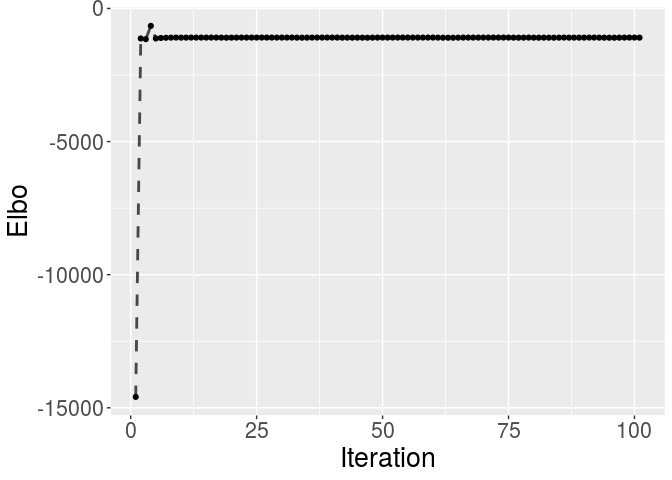
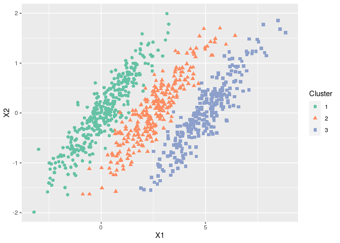

<!-- badges: start -->

[](https://travis-ci.com/nicolasJouvin/FisherEM)
<!-- badges: end -->

> New version of the FisherEM package with the Bayesian Fisher EM
> implemented.

<!-- Not math in github md files -->

<!-- ## The Bayesian Discriminative Latent Mixture model -->

<!-- \begin{align*} -->

<!--  \mu_k & \sim \mathcal{N}_d(0_d, \lambda I_d), \\ -->

<!--  x_i & \sim \sum_k \pi_k  \mathcal{N}_d(\mu_k, \Sigma_k), \\ -->

<!--  y_i \mid x_i, \epsilon_i & \sim \mathcal{N}_p(U x_i, U \Sigma_k U^\top). -->

<!-- \end{align*} -->

## Installation

### R Package installation

#### CRAN dependencies

**FisherEM** needs the following CRAN R packages, so check that they are
are installed on your computer.

``` r
required_CRAN <- c("MASS", "elasticnet", "parallel", "ggplot2")
not_installed_CRAN <- setdiff(required_CRAN, rownames(installed.packages()))
if (length(not_installed_CRAN) > 0) install.packages(not_installed_CRAN)
```

#### Installing FisherEM

  - A planned submission on CRAN in October

<!-- # ```{r package CRAN, eval = FALSE} -->

<!-- # install.packages("FisherEM") -->

<!-- # ``` -->

  - For the development version, use the github install

<!-- end list -->

``` r
remotes::install_github("nicolasJouvin/FisherEM")
```

<!-- - For a specific tagged release, use -->

<!-- ```{r package tag, eval = FALSE} -->

<!-- remotes::install_github("nicolasJouvin/FisherEM@tag_number") -->

<!-- ``` -->

## New features

### Simulation function

We added the script to simulate and reproduce of the BFEM chapter, 3
simulations are available.

``` r
# Chang 1983 setting
n = 300
simu = simu_bfem(n, which = "Chang1983")

# Section 4.2: 
p = 50
noise = 1
simu = simu_bfem(n = 900, which = "section4.2", p = p, noise = noise)

# Section 4.3: 
snr = 3
simu = simu_bfem(n=900, which = "section4.3", snr = snr)
```

#### The Bayesian Fisher-EM algorithm

The function structure, arguments and output are similar to `fem()`and
`sfem()`.

``` r
Y = iris[,-5]
cl_true = iris[,5]
res.bfem = bfem(Y, K = 3, model="DB", init = 'kmeans', method = 'gs', nstart = 10)

print(fem.ari(res.bfem, cl_true))
## [1] 0.9602777
```

#### Visualisation

``` r
ggbound = plot(res.bfem, type = 'elbo')
ggbound
```

<!-- -->

``` r
ggspace = plot(res.bfem, type = 'subspace')
ggspace
```

<!-- -->

#### High-dimensional example

Simulate from the frequentist DLM model with K=3 clusters. The latent
space is of dimension d=2, and the other (p-d) dimensions are centered
Gaussians with variance `noise`. <!-- \begin{align*} -->
<!--    \mu_k = 3 \; (0, k)^\top  & &  \Sigma_{k} = \begin{pmatrix} -->
<!--    1.5 & 0.75 \\ --> <!--    0.75 & 0.45 -->
<!--    \end{pmatrix} & & \pi = (0.4, 0.3, 0.3)^\top. -->
<!-- \end{align*} -->

``` r
simu = simu_bfem(n = 900, which = "section4.2", p = 50, noise = 1)
Y = simu$Y
cl_true = simu$cl_true

# plot true subspace in 2-d
df.true = data.frame(simu$X, Cluster = factor(simu$cls))
ggtrue = ggplot(df.true, aes(x = X1, y=X2, col=Cluster, shape=Cluster)) +
  geom_point(size = 2) +
  scale_color_brewer(palette="Set2")  # color-blind friendly palette
print(ggtrue)
```

<!-- --> And then cluster the
data with the BFEM algorithm.

``` r
res.bfem = bfem(simu$Y, K=3, model = 'DB', nstart = 10, method="gs")

cat('Init ARI : ', aricode::ARI(simu$cls, max.col(res.bfem$Tinit)))
## Init ARI :  0.4052959
cat('Final ARI : ', aricode::ARI(simu$cls, res.bfem$cls))
## Final ARI :  0.9709887

plot(res.bfem, type = "subspace")
```

<!-- -->

## References

  - Original paper for the Fisher-EM algorithm: [Simultaneous
    model-based clustering and visualization in the Fisher
    discriminative
    subspace](https://hal-paris1.archives-ouvertes.fr/hal-00492406v4/document)
    (C. Bouveyron & C. Brunet-Saumard)

  - The Bayesian Fisher-EM: Preprint soon (in October 2020)
